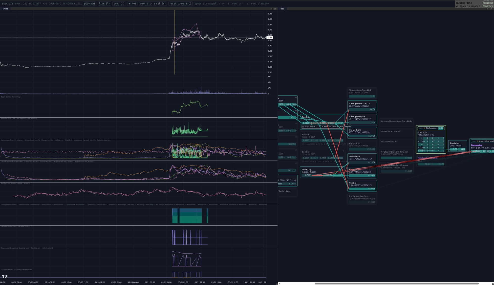

# trading_data

[](https://crates.io/crates/trading_data)
[](https://docs.rs/trading_data)

<br>
[](https://github.com/EV-invest/trading_data/actions?query=branch%3Amain) <!--NB: Won't find it if repo is private-->
[](https://github.com/EV-invest/trading_data/actions?query=branch%3Amain) <!--NB: Won't find it if repo is private-->

A trading framework whose derived-value DAG **is** a type: a node names its dependencies as types, so the node set, the topological order, every buffer's size, which nodes may go dark and which source lanes are loaded at all are read off that one type and monomorphized into one straight-line sweep — cycles are unrepresentable, and work no output reaches does not exist rather than merely going unused.
The same graph runs live or over a recorded month; the only seam between the two is where the events come from.

<!-- TODO!!!: replace with a video walkthrough of the system -->


`examples/spl`: a whole strategy over 32 days of Bybit TAO-USDT, scrubbed tick by tick in [exec_viz](https://github.com/EV-invest/exec_viz) — every node's standing value at the cursor, and the edges that fed it.

🌐 **[Live demo](https://ev-invest.github.io/exec_viz/)** — no setup, runs in the browser. A recorded `examples/spl` run, the still above made scrubbable; `nix run .#spl -- --record demo.tape` is what writes one.
<!-- markdownlint-disable -->
<details>
<summary>
<h2>Installation</h2>
</summary>

```sh
cargo add trading_data
```

Nightly (`nightly-1.92+`). `trading_data` is the whole vocabulary — the sub-crates are wiring detail and are never named directly.

</details>
<!-- markdownlint-restore -->

## Usage
A node states what it reads and how it folds; nothing else. The *reading* a dep asks for — this
tick's batch, a window, the last value whenever it came, or a claim to fold the series itself — is
what tells the engine who holds the history:

```rust
/// Rolling `WIN`-bar quote volume. `None` until the window is whole — a partial sum compared
/// against a threshold is a lie, not a warmup.
#[derive(Clone, Default)]
pub struct RollingVolUsd<const TF: Timeframe, const WIN: usize>;

#[node]
impl<const TF: Timeframe, const WIN: usize> Runs for RollingVolUsd<TF, WIN> {
    type Deps = (Buffering<Bars<TF>, Elems<WIN>>,);

    fn emit(&mut self, (hist,): DepOuts<'_, Self>, out: &mut Vec<Option<f64>>) {
        out.extend(hist.narrowed(Horizon::Elems(WIN)).trailing().map(|w| w.map(|w| w.iter().map(|b| b.vol_base * b.close).sum())));
    }
}
```

The graph names its roots and the handful of nodes anything reads. Everything between — `Ohlcs`,
`Volumes`, `Bars`, their buffers, the order they step in — is walked out of the dependency types;
a node no output reaches is never instantiated, and neither is the lane that would have fed it:

```rust
trading_data::graph! {
    pub struct Graph;
    batches Batches;
    roots { trades: Trades[TradeCols] };
    out TickOut;
    outputs {
        rsi: Rsi<Bars<{ TF_1MIN }>, Len14>,
        vol_usd: RollingVolUsd<{ TF_1MIN }, 60>,
    }
}

/// The whole of an app's routing layer: every lane is present, the graph takes the ones it named.
impl<'t> From<Lanes<'t>> for Batches<'t> {
    fn from(l: Lanes<'t>) -> Self { Self { trades: l.trades } }
}
```

Then pick where events come from. `required_lanes::<Graph>()` is the graph's dep tree read as
storage, so a `Replay` loads exactly what will be looked at:

```rust
let lanes = required_lanes::<Graph>();
let mut feed = Replay::new(&catalog, ExchangeName::Bybit, symbol(), start, end, &lanes, latency, ReadClock::from(Exact::from_nanos(60_000_000_000)));
// ...or the same graph on the wire, which states no clock and cannot be given one:
// let mut feed = Live::new(catalog, ExchangeName::Bybit, symbol(), prec, false, Arc::new(LiveClock));

while let Some(l) = feed.next() {
    for intent in graph.tick(l.ts_venue.as_nanos(), l.into()).signal.iter().flatten() { /* ... */ }
}
```

`Live` tees every event into the lanes a backtest later reads, so the two are the same graph over
the same events — [not the same run](./docs/ARCHITECTURE.md#live-never-clocks-a-backtest-is-expected-to).

Runnable, smallest first: `nix run .#simple` (one day, one root, one RSI chain), `nix run .#live`
(real Bybit, watchable as it runs), `nix run .#spl` (the strategy above).

## Benches

The same strategy, three times over one tape: through this graph, and twice through
[NautilusTrader](https://github.com/nautechsystems/nautilus_trader) — once with every feed
subscribed for the whole run, once with the delta feed opened on a screener hit and closed when the
situation ends, which is NT's answer to what `Gating<Screener>` is here. Our nodes do the arithmetic
in all three; what differs is the framework carrying them.

`compute = total - feed` is the column that compares — `feed` is the same run with the strategy
removed, so td's per-day parquet decode stops flattering NT's, which happened at setup. Tick counts
differ by construction (a td tick is a `ReadClock` cell of arrivals, an NT pass is one event), so the
shared call sites are counted instead. Every row rests on the `equivalence` bench, which gates the
other three by driving our nodes by hand and demanding the graph's intent stream back.

<!-- bench:begin -->
```
bench            total s    feed s   compute     cpu s   cores  rss p68 MB  rss p95 MB   intents             digest
naive_nt            8.97      3.12      5.85      8.98    1.00        2031        2032    161090   f76140ed3e3cdc78
optimized_nt        8.06      3.08      4.97      8.06    1.00        2031        2031    161076   8799bd3ada1de6f0
td_graph            2.14      1.44      0.70      2.15    1.00         403         403    138805   714c4c8498e78bde
naive_nt: cpus 12-15,28-31 (8 of them)
optimized_nt: cpus 12-15,28-31 (8 of them)
td_graph: cpus 12-15,28-31 (8 of them)

passes          bars_closed     classify     decision       deltas   deprecator     screener       trades
naive_nt               3501          310          310      6751349       729850         2879       910878
optimized_nt           3501          310          310      6751349       519368         2879       910878
td_graph                  0       972857       972857      6751349       972857       972857       910878

DIGESTS DIFFER — the rows above are timing different work, see each row's notes
  naive_nt: every feed subscribed for the whole run
  naive_nt: every indie recomputed on every event it clocks off, hit or miss
  naive_nt: bars are NT's internal TimeBarAggregator, which closes on its clock; ours closes when the next out-of-bucket trade lands
  naive_nt: no tick: each node fires on the event its deps are clocked by, so imbalance/spread read the latest book rather than this tick's
  naive_nt: 4h and 1h closes reach their rings on the next 5m/1m close, since NT does not order aggregators against each other
  optimized_nt: book deltas subscribed only between a screener hit and the situation's terminal intent
  optimized_nt: a reopened book starts empty, so imbalance/spread read None until both sides refill
  optimized_nt: bars are NT's internal TimeBarAggregator, which closes on its clock; ours closes when the next out-of-bucket trade lands
  optimized_nt: no tick: each node fires on the event its deps are clocked by, so imbalance/spread read the latest book rather than this tick's
  optimized_nt: 4h and 1h closes reach their rings on the next 5m/1m close, since NT does not order aggregators against each other
  td_graph: pass counts are tick counts: the gated subtree's skips are not observable from outside the graph
  td_graph: bars_closed is not an output of this graph, so it reads 0 here
  td_graph: also computes Rsi, which the NT rows have no counterpart for
  td_graph: total includes the per-day parquet decode; NT decodes its whole tape at setup, so only the compute column compares
```
<!-- bench:end -->

Read, not typed: `BENCH_CPUS=12-15,28-31 nix run .#spl_bench` splices whatever it measures back into
this section. The CPU list names both SMT siblings of every core it claims, because a leg taken on a
contended core lands in a committed document and stays there. `examples/spl/cost.typ` takes the
other reading — where the replay's own wall clock goes, itemized.


<br>

<sup>
	This repository follows <a href="https://github.com/valeratrades/.github/tree/master/best_practices">my best practices</a> and <a href="https://github.com/tigerbeetle/tigerbeetle/blob/main/docs/TIGER_STYLE.md">Tiger Style</a> (except "proper capitalization for acronyms": (VsrState, not VSRState) and formatting). For project's architecture, see <a href="./docs/ARCHITECTURE.md">ARCHITECTURE.md</a>.
</sup>

#### License

<sup>
	Licensed under <a href="LICENSE">Blue Oak 1.0.0</a>
</sup>

<br>

<sub>
	Unless you explicitly state otherwise, any contribution intentionally submitted
for inclusion in this crate by you, as defined in the Apache-2.0 license, shall
be licensed as above, without any additional terms or conditions.
</sub>

