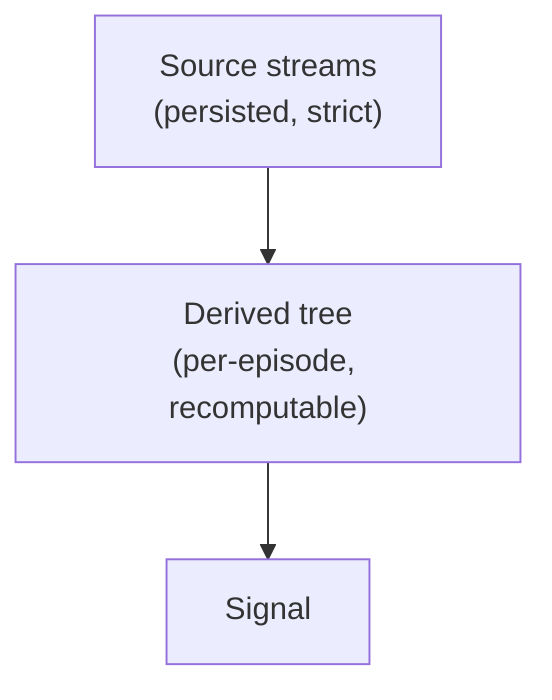

# Architecture



**Source** is persisted strictly and structurally — the observed streams (LOB, Trades,
OI, Liqs, MC, LSR, News): a property of the situation. **Derived** values ("Indies") are
computed on top per-episode and never touch the source store; they can always be
recalculated, so recomputing them can't muddy persistence.

## Crates

```
trading_data_dag                     #![no_std], zero deps — domain-free derivation engine
trading_data_derivatives    zero deps — indicator state machines, embedded inside user Nodes; never learn Cell/Node
trading_data_persistence    arrow/parquet — catalog, lanes, feather writer, and `sync`: the central replay/live weaver
trading_data_macros                  proc-macro home of `graph!` (emits the `step` chain over `::trading_data_dag`)
        ▲          ▲          ▲
        └──────────┴──────────┘
             trading_data            facade/prelude; `required_lanes<G>()` maps a graph's dep tree to source lanes
                   ▲
    trading_data_demo (examples/demo)   end-to-end demo; depends ONLY on the facade (facade-sufficiency test)
```

`trading_data_dag`'s `no_std` IS the enforced boundary: the engine can never grow domain or I/O
knowledge. Persistence knows nothing of derivations.

<a id="dep_tree"></a>
## Dependency tree

Derived values form a DAG known at compile time. We express the edges in the type system:
each node names its dependencies as a type, the compiler enforces a valid evaluation order,
and cycles are unrepresentable — at zero runtime cost.

Cells are GAT-shaped and **batch-native**: an out is `&'t [T]` (a run of events) or `&'t Book`, a
first-class dependency rather than a side-channel context argument. `advance` self-borrows, so a
node lends its own emission buffer for the whole tick:

```rust
pub trait Cell { type Out<'t>: Copy; }             // &'t [T] and &'t Book are Outs
pub trait Node: Cell {
    type Deps: DepSet;                             // the edges, as a tuple of Cells
    fn advance<'t>(&'t mut self, deps: DepOuts<'t, Self>) -> Self::Out<'t>;
}
```

A tick accumulates outputs into a **frame** — a type-indexed HList. `step` advances one node,
prepending its output; its `Pull` bound is the entire enforcement (frame MUST already hold all of
`N`'s deps — wrong order names the missing `Has<Dep>`). The whole sweep monomorphizes to one
straight-line function. See `trading_data_dag`'s crate docs and tests for the worked form.

Structural rules (enforced by the signatures, not convention):

- **Roots are the router's lanes.** A graph declares `roots { field: Cell[Event] }`; each tick a
  batch of one source lane seeds the frame as `&'t [Event]`. `Node::advance` self-borrows, so a
  node's out is a slice into its own buffer (or `&'t Book` of borrowed state). The "nodes are Copy
  values" doctrine is dead; the buffer just outlives the tick.
- **Rate is slice length, firing is element `Option`-ness.** A rate-preserving node emits one
  element per driving-dep element, `Option`-valued where it declines (warmup) — same-rate deps
  zip by index (`assert_eq!` on len is the tripwire). A rate-changing node (trades→bars) emits one
  non-optional element per own event. Cross-rate reads take `.last()` as the level view.
- **Node identity = its type.** Two instances of one node type in a frame are ambiguous —
  compile error; distinguish via newtypes/const generics (`Rsi<14>` vs `Rsi<28>`).
- **Gates operate on scalar cells only.** A `Gate` is a `bool`-out node; nodes naming it in `When`
  are skipped while it's false. A batch-out node can be neither gate nor gated (tick-level gating
  on a batch is lossy, and a self-borrowing batch out can't be reset). *Historic* nodes (stateful)
  must advance every tick to stay warm: gating one is a compile error; only *current* nodes gate.
  A current node whose every in-graph consumer sits behind one gate must be gated too — `graph!`
  rejects the omission at compile time.
- **Latches.** A `Latch` is a `Gate` armed from outside and cut from within (an SCR): an external
  event arms it; when its `Cut` node publishes an `Episode::terminal` out, `graph!` commutates it
  and resets every node gated on it to `Default` at the *next* tick's start (deferred: the frame
  still borrows batch fields at end-of-tick). One episode at a time; triggers during one are absorbed.
- **Universe/cross-sectional ops** are graph composition, not an execution tier: per-symbol graphs
  are values; a universe-level graph ticks at bar cadence, its roots seeded from theirs.
- **Parallelism is across symbols (live) / episodes (backtest) only** — one graph per unit, rayon
  across. Never intra-tick.

## One graph, one router, two feeds

The **backtest / live** seam is only where events come from. `persistence::sync` weaves the
required source lanes into one arrival-ordered stream of same-type `Batch`es (a `Feed`). `Replay`
feeds from the catalog; `Live` feeds from push handles and *tees* every event into the same Feather
lanes a backtest later reads — so a live recording replays into the identical batch stream (the
round-trip is the invariant test). Arrival time is `ts_init` when real (live-recorded, `Some`),
else latency-simulated from `ts_event` (historic ingest writes `None`). Node code is identical
across the two.

## Polars boundary

No polars execution tier in the engine, ever. Measured: columnar execution *loses* to the
interleaved sweep — indicators are recurrences/sliding windows (sequential carry, no SIMD
lanes exist). Polars remains (a) offline research/EDA over the parquet, (b) a test oracle in
property tests (dev-dep only).
