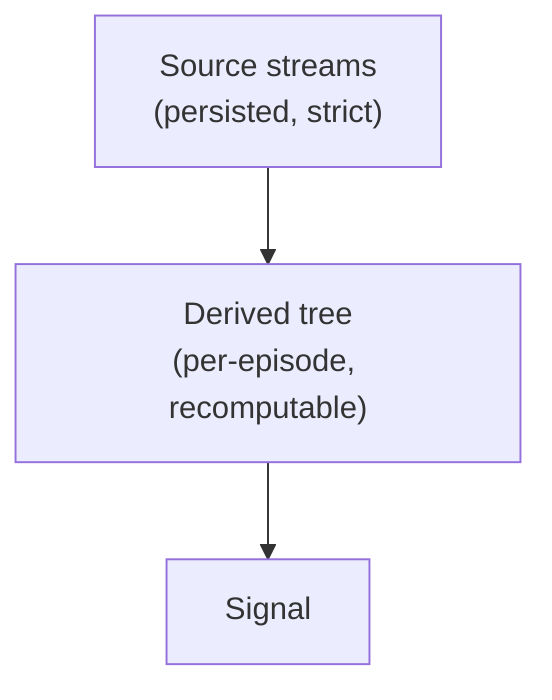

# Architecture



**Source** is persisted strictly and structurally — the observed streams (LOB, Trades,
OI, Liqs, MC, LSR, News): a property of the situation. **Derived** values ("Indies") are
computed on top per-episode and never touch the source store; they can always be
recalculated, so recomputing them can't muddy persistence.

<a id="dep_tree"></a>
## Dependency tree

Derived values form a DAG known at compile time. We express the edges in the type system:
each node names its dependencies as a type, the compiler enforces a valid evaluation order,
and cycles are unrepresentable — at zero runtime cost.

A node declares its upstream cells and how it advances from their outputs:

```rust
pub trait Cell { type Out: Copy; }                 // a value in the frame: root or derived
pub trait Node: Cell {
    type Deps: DepSet;                             // the edges, as a tuple of Cells
    fn advance(&mut self, deps: <Self::Deps as DepSet>::Outs) -> Self::Out;
}
```

A tick accumulates outputs into a **frame** — a type-indexed HList. `step` advances one node,
prepending its output; its bound is the entire enforcement:

```rust
pub fn step<N, F, I>(frame: F, node: &mut N) -> Cons<N, F>
where N: Node, N::Deps: Pull<F, I> {              // frame MUST already hold all of N's deps
    let out = node.advance(<N::Deps as Pull<F, I>>::pull(&frame));
    Cons { out, tail: frame }
}
```

`Pull` gathers a node's dep-tuple out of the frame, which only type-checks if the frame
`Has` every member (frunk-style type-indexed lookup). So the graph is expressed by a chain
of `step`s in any valid order:

```rust
let f = seed(ev);                 // roots seeded from the triggering event
let f = step(f, &mut mid);        // Deps = (Book,)          -> needs Has<Book>   ok
let f = step(f, &mut rsi);        // Deps = (Mid,)           -> needs Has<Mid>    ok
let f = step(f, &mut regime);     // Deps = (Rsi,)           -> needs Has<Rsi>    ok
let sig = step(f, &mut signal).head(); // Deps = (Regime, Vol1m)                 ok
```

What this buys:

- **Wrong order = compile error.** `step(rsi)` before `step(mid)` leaves `Has<Mid>`
  unsatisfied; the compiler names the missing dependency.
- **Cycles are unrepresentable.** To depend on a node you must have already stepped it into
  the frame; nothing can precede itself.
- **Adding an edge touches one line** — extend `type Deps`; every `step` re-routes via `Pull`.
- **Zero runtime cost.** `Cons`/`Has` monomorphize to flat field access; the frame is a
  compile-time artifact.

Node **state** persists across ticks (held in the graph struct); the **frame** is ephemeral
per tick. Roots emit `Option<T>` for event streams (Some only on the tick they fire) and
plain values for levels — that, and nothing more, is what keeps multi-rate inputs correct.

The **backtest / live** seam is only the event iterator (replay vs socket); node code is
identical. Roughly half the nodes branch on predicates over their own history and are only
expressible as `advance`; the pure, bounded-window ones may *additionally* carry a polars
expression as a backtest-only vectorized fast path, guarded by an equivalence test.

See `tmp/arch_exploration/lib.rs` for a full worked sketch.
