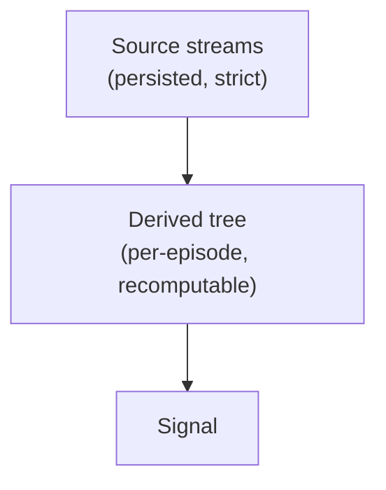

# Architecture



**Source** is persisted strictly and structurally — the observed streams (LOB, Trades, OI, Liqs, MC,
LSR, News): a property of the situation. **Derived** values ("Indies") are computed on top
per-episode and never touch the source store; they can always be recalculated, so recomputing them
can't muddy persistence.

Two sentences hold up everything below, and each sub-crate is one of them made mechanical:

- **A strategy may read only what it had already received.** So the stream's order is *reception*
  order, and reception is a reading only we can make — the venue's execution axis says what
  happened, never when we could have acted on it.
- **Backtest and live are the same graph over the same events — not the same run.** The seam
  between them is only where events come from. What a backtest does differ in is how often nodes
  get to look at all: it batches to finish faster, and inside a batch the strategy never acts
  between events that arrived apart. That is the approximation, it is deliberate, and [backtests
  are fundamentally imprecise](#live-never-clocks-a-backtest-is-expected-to) because of it.

## Crates

```
trading_data_expr           #![no_std], one dep (libm) — the primitive algebra: one expression, four readings
                            (eval / exact grad / LaTeX / value-annotated trace)
trading_data_dag            core + alloc in its own source — domain-free derivation engine
trading_data_derivatives    the fundamental primitives: indicator state machines, and the bar/RSI nodes that are
                            nothing but those machines wired to a series — every strategy names these
trading_data_core           the shared parse boundary both exchange_interactions and persistence see: BatchTrades, the raw
                            columnar lane holders, the Book fold + ShadowBook, and (orphan rules) their dag impls
trading_data_persistence    arrow/parquet — catalog, lanes, feather writer, and `sync`: the central replay/live weaver
trading_data_macros         proc-macro home of `#[node]` and `graph!`: the first leaves a node's `Deps` where a
                            macro can read them, the second walks them into the sweep
        ▲          ▲          ▲
        └──────────┴──────────┘
             trading_data            facade/prelude; `required_lanes<G>()` maps a graph's dep tree to source lanes
                   ▲
    trading_data_simple (examples/simple)   one day, one root, one RSI chain — the cheap framework testbed
    trading_data_live_example (examples/live)   real Bybit trades+book, live until ctrl-c, watchable as it runs
    trading_data_spl (examples/spl)     a whole strategy (scam_pump_liqs); its bus plumbing becomes `type Deps`
```

What each arrow may and may not be — and why an example is allowed exactly one of them — is stated
in [docs/spec/boundaries.md](spec/boundaries.md).

`trading_data`'s exports are the client's whole vocabulary: a name is there because a graph, a
`#[node]` body or a call into the storage tier can spell it, and everything the macros write on the
author's behalf is reached out of sight. The list is pinned to a snapshot, so a name enters or
leaves by review.

`trading_data_core` sits below both persistence and the external `exchange_interactions` bridge, so
a live ws `BatchTrades` extends the lane columns and the parquet writer in one pass — no exchange
type leaks into the store, no store type leaks into the exchange layer.

`trading_data_dag` reaches for `core` and `alloc` and for nothing else — no `std::` path appears in
its source, so the engine has no route to I/O. What it no longer carries is the `#![no_std]` that
made that a *check* rather than a habit: `Horizon::Over` is a `v_utils::Timeframe`, and that crate
links std. Persistence knows nothing of derivations; core depends on the dag only because orphan
rules put a type's impls in the type's crate, and nothing flows back.

### Where the detail lives

Two sub-crates carry their own design document, written in their own primitives. This file states
what they are *for* and what the rest of the system may assume of them; it does not restate how
they work.

| document | covers |
|---|---|
| [`trading_data_dag/model.typ`](../trading_data_dag/model.typ) | declaration → derivation → sweep → observation; the dep spellings and what each retains; the step family; horizons and rates; the out plane; every enforcement point |
| [`trading_data_persistence/weaver.typ`](../trading_data_persistence/weaver.typ) | the arrival key and the read clock; the lane; the merge step; the five lanes and their shapes; the two feeds; what the storage round-trip proves, and why it is not evidence that a backtest reproduces a live run |

The same pattern is meant to repeat downward: a document reasons in the primitives of its own
level and links out for the tier below.

## The derived tree

Derived values form a DAG known at compile time, and its edges are **types**: a node names its
dependencies as a type, so the compiler enforces a valid evaluation order and cycles are
unrepresentable — at zero runtime cost.

That type *is* the graph. A declaration states its roots and the handful of nodes an app reads; the
node set, its topological order, every buffer's size, and which nodes may go dark are all derived by
walking the dependencies backwards. A node no output reaches is never instantiated: unneeded work is
not merely unused, it does not exist, and neither does the source lane that would have fed it. The
whole sweep monomorphizes to one straight-line function.

Cells are **batch-native**: an out is a run of events, a first-class dependency rather than a
side-channel context argument, and a node lends its own emission buffer for the whole tick.

Everything an author would otherwise have to state by hand is instead read off that one type. Three
consequences shape how a strategy is written; the mechanisms are `model.typ`'s subject:

- **A dep says which *reading* of its producer it wants** — this tick's batch, a window, the last
  value whenever it came, or a claim to fold the series itself. The axis those spellings partition
  is *who holds the history*: history the engine holds re-warms through a skip, history a node holds
  cannot, so the compiler refuses to gate a node that folds its own reach. *How* the engine holds it
  is the series' own to say — a series whose rows collapse pays depth rather than volume, which is
  what makes retention affordable for a lane no buffer could otherwise hold. A node whose sleep
  outruns every retention is **anchored** instead: replayed forward out of the feed's recorded past
  on the tick it is demanded, so there is no window in which a wired node reports absence.
- **Gating and demand are the same edge read in the two directions.** Gating states what a node
  needs; demand is whether anyone will read what it produces, and it is derived rather than badged —
  a hand-written badge on six indicators is six restatements of what one edge already said. What a
  skip costs the author is a *type*: an out with no unfired reading cannot be skipped, and says so
  at compile time.
- **A node owns its rate.** How often a node publishes is declared on the node, never in its deps —
  so no consumer can change the rate of what it reads, and a node clocked to a timeframe sees
  completed elements only. The counterpart obligation is on the dep side: a read never says whether
  that dep produced *this tick*. Both, with their consequences, in
  [docs/spec/rates.md](spec/rates.md).

Universe/cross-sectional work is graph **composition**, not an execution tier: per-symbol graphs are
values, and a universe-level graph ticks at bar cadence with its roots seeded from theirs.

## What the store records

**A lane is columns, not rows, and the columns are raw end to end** — venue `i32` → lane `i32` →
parquet `i32`, and back, with no f64 round trip anywhere to lose a bit in. Precision belongs to the
*holder* rather than the element, so a scale is applied once per run and not once per value; the one
lane carrying it per element says why the rule is otherwise, since a retained lane is handed out an
item at a time and nothing holder-shaped survives to scale them by. Each lane keeps its natural
shape — uniformity across lanes was the sin of the tagged-union batch this replaced. The single
decimal→raw conversion left is at the parse boundary, where the exactness assert belongs.

**Anything a replay would otherwise re-derive from circumstance is decided once, at ingest, and
written down as a fact on disk.** Arrival order, book reconciliation, lane precision and file extent
are decisions, not measurements to be repeated — which is what makes a recording replayable rather
than merely re-readable.

The load-bearing case is the book. A gap or a resync is a fact about *our connection*, not about the
market: stored raw, every replay would re-derive the reconciliation from whichever venue snapshots
happened to land, a cadence we neither control nor can reproduce. So the persisted delta lane is our
own recollection — gapless, self-consistent, checkpointed on our cadence, venue snapshots consumed
but never stored — and the reconciliation survives per row, so a flow or imbalance node must say
which it means and cannot fabricate signal out of a dropped websocket packet.

The exception proves the rule: a historic row we were not present for has no recorded reception, so
that one key is manufactured — deterministically, seeded on lane and symbol, so two runs of a range
weave identically. Per-case detail, and the enforcement, in
[`weaver.typ`](../trading_data_persistence/weaver.typ) §1.8.

## One graph, one router, two feeds

The **backtest / live** seam is only where events come from. `persistence::sync` weaves the required
source lanes into one arrival-ordered stream — every lane present, lanes that did not arrive empty.
An app's whole routing layer is one `From` impl. `Replay` feeds from the catalog; `Live` feeds from
push handles and *tees* every event into the same lanes a backtest later reads. Node code is
identical across the two.

What the tee guarantees is a **storage** claim and only that: everything `Live` recorded comes back
out of `Replay`, in order, folding to the same book. It is not a claim that the two runs agree —
see below.

`Live` is **zero-cost**: an event is folded into a tick before the feed blocks on the next one, so
choosing the engine costs nothing hand-rolling the same loop against the raw socket would not have
cost too. This is what rules out every grid-shaped batching scheme that has to know a window is
*closed* before it can emit it — stated, with its consequences, in
[docs/spec/feeds.md](spec/feeds.md). A grouping rule may exist only if it degenerates to on-arrival
under `Live` instead of being switched off there.

The two also differ in cost profile. `Live` is streaming and memory-bounded: a long-lived session
accumulates nothing and tees to disk incrementally. `Replay` eager-loads its range, so a window
wider than memory is *chained* — successive replays over one long-lived graph, which carries its
node state across.

### Live never clocks; a backtest is expected to

**`Live` states no rate, and cannot be given one.** Whatever is buffered by the time it gets there is
folded together — the same aggressive batching a backtest does, with the *waiting* removed, because a
cell of any finite size is a wait and a `Live` that waits for one to close is a `Live` that trades
late. How a live run happens to group is a function of how busy the consumer was, not of a knob.
**`Replay` states a read clock**, and that is the whole of what the type is for: it cuts arrival time
into absolute cells, so a backtest gets through a day faster than the day took and a replay of a
range groups identically every time.

**Inside one cell, events get mixed up, and that is expected.** Two events that arrived a
millisecond apart reach the graph together; the strategy never gets to act between them, and so it
can decide differently than it would have on the live wire. What changes is how often nodes get to
look at all — which for anything reading a running extremum or a threshold crossing over *evaluated*
states is a real difference in what it sees.

**We do not care about those mismatches, and nothing should assert them away.** A backtest is a
model of a live run, and the batching above is exactly where it is lossy; the read clock is the dial
between how fast the backtest finishes and how finely it resolves. Treating a backtest as though it
reproduced a live run — asserting the two agree event for event, tuning until they do — buys a green
check that means nothing and costs confusion later, when the difference that mattered gets read as a
bug in the engine rather than as the approximation it always was. **Backtests are fundamentally
imprecise.** Size the read clock for the question being asked, and read the answer as an estimate.

## Deliberate absences

Invariants stated as what is *not* there — none of these can be divined from reading the code.

- **No runtime graph.** No dispatch, no node registry, no dynamic edges.
- **No routing discriminant.** Batch-ness needs no tag; it iterates.
- **No clock in `Live`**, and no way to give it one.
- **No read that reveals the tick.** A node cannot ask whether a dep produced this time round, which
  is what keeps its output a measurement of the market rather than of the feed's batching.
- **No node that is a pane.** A node names slot groups of its out for drawing, so drawing never
  motivates a node: a step that computes nothing, and differentiates to nothing, stays out of the
  topology.
- **No intra-tick parallelism.** One graph per unit; rayon across symbols (live) or episodes
  (backtest).
- **No polars execution tier in the engine, ever.** Measured: columnar execution *loses* to the
  interleaved sweep — indicators are recurrences and sliding windows, sequential carry, no SIMD
  lanes exist. Polars remains offline research/EDA over the parquet, and a test oracle in property
  tests (dev-dep only).
