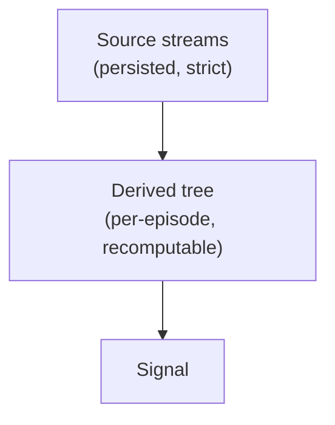

# Architecture



**Source** is persisted strictly and structurally — the observed streams (LOB, Trades,
OI, Liqs, MC, LSR, News): a property of the situation. **Derived** values ("Indies") are
computed on top per-episode and never touch the source store; they can always be
recalculated, so recomputing them can't muddy persistence.

## Crates

```
dep_dag                     #![no_std], zero deps — domain-free derivation engine
trading_data_derivatives    zero deps — indicator state machines, embedded inside user Nodes; never learn Cell/Node
trading_data_persistence    arrow/parquet — catalog, lanes, feather writer, typed replay
        ▲          ▲          ▲
        └──────────┴──────────┘
             trading_data            facade/prelude + the collector binary
                   ▲
           trading_data_demo         end-to-end demo; depends ONLY on the facade (facade-sufficiency test)

trading_data_macros                  future `graph!` (pure ergonomics — `Pull` already rejects bad orders)
```

`dep_dag`'s `no_std` IS the enforced boundary: the engine can never grow domain or I/O
knowledge. Persistence knows nothing of derivations.

<a id="dep_tree"></a>
## Dependency tree

Derived values form a DAG known at compile time. We express the edges in the type system:
each node names its dependencies as a type, the compiler enforces a valid evaluation order,
and cycles are unrepresentable — at zero runtime cost.

Cells are GAT-shaped so heavy root state enters the frame **by reference**, a first-class
dependency rather than a side-channel context argument:

```rust
pub trait Cell { type Out<'t>: Copy; }             // references are Copy: &'t Book is an Out
pub trait Node: Cell {
    type Deps: DepSet;                             // the edges, as a tuple of Cells
    fn advance<'t>(&mut self, deps: DepOuts<'t, Self>) -> Self::Out<'t>;
}
```

A tick accumulates outputs into a **frame** — a type-indexed HList. `step` advances one node,
prepending its output; its bound is the entire enforcement:

```rust
pub fn step<'t, N, F, I>(frame: F, node: &mut N) -> Cons<'t, N, F>
where N: Node, N::Deps: Pull<'t, F, I>, F: 't {   // frame MUST already hold all of N's deps
    let out = node.advance(<N::Deps as Pull<'t, F, I>>::pull(&frame));
    Cons { out, tail: frame }
}
```

Wrong order = compile error (the missing `Has<Dep>` is named); cycles are unrepresentable;
adding an edge touches one line; the whole sweep monomorphizes to one straight-line function.
See `dep_dag`'s crate docs and tests for the worked form.

Structural rules (enforced by the signatures, not convention):

- **Roots vs nodes.** Heavy stateful reducers (the order book) are *roots*: updated before
  the frame is seeded, entering it as `&'t State`. `Node::advance` cannot return borrows of
  its own state — deliberately. Nodes compute `Copy` values, incl. `Option<&'t T>` of
  root-borrowed data.
- **Multi-rate = `Option` outs.** A root/node that didn't fire this tick yields `None`;
  dependents short-circuit. That, and nothing more, keeps multi-rate inputs correct — and is
  equality early-cutoff for free.
- **Node identity = its type.** Two instances of one node type in a frame are ambiguous —
  compile error; distinguish via newtypes/const generics (`Rsi<14>` vs `Rsi<28>`).
- Time-windowed logic with no event flow (expiry, decay) gets a `Time` root cell seeded each
  tick.
- **Universe/cross-sectional ops** are graph composition, not an execution tier: per-symbol
  graphs are values; a universe-level graph ticks at bar cadence, its roots seeded from the
  per-symbol graphs' collected outputs.
- **Parallelism is across symbols (live) / episodes (backtest) only** — one graph per unit,
  rayon across. Never intra-tick (measured ~1400x under water at trade cadence).

The **backtest / live** seam is only the event iterator (replay vs socket); node code is
identical.

## Polars boundary

No polars execution tier in the engine, ever. Measured: columnar execution *loses* to the
interleaved sweep — indicators are recurrences/sliding windows (sequential carry, no SIMD
lanes exist). Polars remains (a) offline research/EDA over the parquet, (b) a test oracle in
property tests (dev-dep only).
