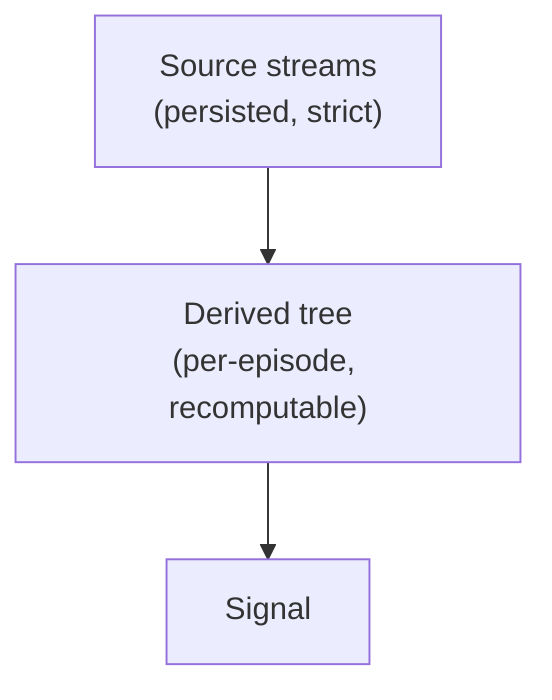

# Architecture



**Source** is persisted strictly and structurally — the observed streams (LOB, Trades,
OI, Liqs, MC, LSR, News): a property of the situation. **Derived** values ("Indies") are
computed on top per-episode and never touch the source store; they can always be
recalculated, so recomputing them can't muddy persistence.

## Crates

```
trading_data_dag                     #![no_std], zero deps — domain-free derivation engine
trading_data_derivatives    zero deps — indicator state machines, embedded inside user Nodes; never learn Cell/Node
trading_data_core           the shared parse boundary both v_exchanges and persistence see: BatchTrades, the raw
                            columnar lane holders, the Book fold + ShadowBook, and (orphan rules) their dag impls
trading_data_persistence    arrow/parquet — catalog, lanes, feather writer, and `sync`: the central replay/live weaver
trading_data_macros                  proc-macro home of `graph!` (emits the `step` chain over `::trading_data_dag`)
        ▲          ▲          ▲
        └──────────┴──────────┘
             trading_data            facade/prelude; `required_lanes<G>()` maps a graph's dep tree to source lanes
                   ▲
    trading_data_demo (examples/demo)   end-to-end demo; depends ONLY on the facade (facade-sufficiency test)
    trading_data_live_example (examples/live)   real Bybit trades+book recorded then replayed identically
    trading_data_spl (examples/spl)     a whole strategy (scam_pump_liqs); its bus plumbing becomes graph! field order
```

`trading_data_core` sits below both persistence and the external `v_exchanges` bridge, so a live ws
`BatchTrades` extends the lane columns and the parquet writer in one pass — no exchange type leaks
into the store, no store type leaks into the exchange layer.

`trading_data_dag`'s `no_std` IS the enforced boundary: the engine can never grow domain or I/O
knowledge. Persistence knows nothing of derivations. Core depends on the dag for `Flat`/`Glance`/
`Cell` only because orphan rules put a type's impls in the type's crate — nothing flows back.

## Raw columnar lanes

A lane is columns, not rows, and the columns are **raw** end to end: venue `i32` → lane `i32` →
parquet `i32`, and back. Precision belongs to the *holder* (`TradeCols::prec`), not the element, so a
node hoists `prec.price_scale()` once per run and divides inside the loop — one setup per batch
instead of a conversion per element, and no f64 round trip anywhere to lose a bit in. The single
decimal→raw conversion left is at the CSV parse boundary, where the exactness assert belongs.

Precision-on-the-holder is why a run stays whole: `Feather::extend(cols)` is one append and one
rotation check for a whole venue message, where the row model was N pushes and N flush checks.

Each lane keeps its natural shape — Oi/Mc are genuinely f64 and stay `&[Oi]`/`&[Mc]`. Uniformity was
the old `Batch` enum's sin.

Finite differences respect the grid: `Nudge::stage` returns the perturbation it **actually** applied,
so a raw column bumps by whole ticks and reports `ticks / scale`, and a discrete slot reports `0.0`
and leaves its Jacobian column NaN rather than a fabricated zero.

## The shadow book: we persist our own recollection

A gap or a resync is a fact about *our connection*, not about the market. Stored raw, every replay
would re-derive the reconciliation from whatever venue snapshots happened to land, so the replayed
book would depend on a cadence we neither control nor can reproduce.

`ShadowBook` consumes the venue stream at ingest and emits ours:

| venue input | emitted |
|---|---|
| delta, chain intact | `DeltaFrame::Update` — the levels, verbatim |
| delta, gapped | `DeltaFrame::Correction` |
| snapshot agreeing with our fold | nothing |
| snapshot disagreeing | `DeltaFrame::Correction` — exactly the diffs |
| our cadence elapsed | a `BookShape` checkpoint |

The persisted delta lane is therefore gapless and self-consistent, and checkpoints are ours on our
cadence — venue snapshots are consumed, never stored. `Book` folds both kinds identically; the kind
is the frame's *identity* so that a flow or imbalance node must say explicitly which it means, and
cannot fabricate signal out of a dropped websocket packet.

<a id="dep_tree"></a>
## Dependency tree

Derived values form a DAG known at compile time. We express the edges in the type system:
each node names its dependencies as a type, the compiler enforces a valid evaluation order,
and cycles are unrepresentable — at zero runtime cost.

Cells are GAT-shaped and **batch-native**: an out is `&'t [T]` (a run of events) or `&'t Book`, a
first-class dependency rather than a side-channel context argument. `advance` self-borrows, so a
node lends its own emission buffer for the whole tick:

```rust
pub trait Cell { type Out<'t>: Copy; }             // &'t [T] and &'t Book are Outs
pub trait Node: Cell {
    type Deps: DepSet;                             // the edges, as a tuple of Cells
    fn advance<'t>(&'t mut self, deps: DepOuts<'t, Self>) -> Self::Out<'t>;
}
```

A tick accumulates outputs into a **frame** — a type-indexed HList. `step` advances one node,
prepending its output; its `Pull` bound is the entire enforcement (frame MUST already hold all of
`N`'s deps — wrong order names the missing `Has<Dep>`). The whole sweep monomorphizes to one
straight-line function. See `trading_data_dag`'s crate docs and tests for the worked form.

Structural rules (enforced by the signatures, not convention):

- **Roots are the router's lanes.** A graph declares `roots { field: Cell[Event] }`; each tick a
  batch of one source lane seeds the frame as `&'t [Event]`. `Node::advance` self-borrows, so a
  node's out is a slice into its own buffer (or `&'t Book` of borrowed state). The "nodes are Copy
  values" doctrine is dead; the buffer just outlives the tick.
- **Rate is slice length, firing is element `Option`-ness.** A rate-preserving node emits one
  element per driving-dep element, `Option`-valued where it declines (warmup) — same-rate deps
  zip by index (`assert_eq!` on len is the tripwire). A rate-changing node (trades→bars) emits one
  non-optional element per own event. Cross-rate reads take `.last()` as the level view.
- **Emptiness is per slot, and NaN spells it.** `Flat` flattens an out into a fixed-width
  `&mut [f64]`; a NaN slot means *no value there*, not a value. Per-slot because a struct's fields
  warm independently — a momentum out fires the moment its 5m Sharpe exists, hours before its 4h
  one, so an `Option<[f64]>` could only report the cold field by discarding the warm ones. NaN
  because the buffer's arithmetic consumer is the finite-difference Jacobian, where absence is
  the absorbing element: an absent dep leaves its column NaN, and a `Symbolic` body carries absence
  through its arithmetic — neither spends a branch. The encoding stops at the engine: every
  boundary a human reads converts each empty slot to a real `None`.
- **A node is not a pane.** `PLOTS` lets a node name several slot groups of its `Flat` out, each
  with its own scale, guides, labels and `overlay` — axes partition by *unit*, and one out can mix
  them (a deprecator's sizes beside its price-denominated stop levels). So drawing never motivates a
  node: a step that computes nothing, and differentiates to nothing, stays out of the topology.
- **Node identity = its type.** Two instances of one node type in a frame are ambiguous —
  compile error; distinguish via newtypes/const generics (`Rsi<14>` vs `Rsi<28>`).
- **A gate is scalar-out; a gated node may be batch-out.** A `Gate` is a `bool`-out node; nodes
  naming it in `When` are skipped while it's false. The gate resolves once per tick, so a gated
  batch node's episode boundary is quantized to its batch window. *Historic* nodes (stateful)
  must advance every tick to stay warm: gating one is a compile error; only *current* nodes gate.
  A current node whose every in-graph consumer sits behind one gate must be gated too — `graph!`
  rejects the omission at compile time.
- **Gateable stateful nodes.** `Book` is the worked example: its out is `Option<&Book>` (hence
  `Latent`, hence gateable) and `HISTORIC = false` is sound because — unlike a recurrence — a book
  **re-warms from a checkpoint**. Gate it off and the frames go by unread; gate it back on and the
  `monotonic_seq` discontinuity desyncs it, so it never folds onto stale state. A checkpoint is a
  standing offer, taken only by a book with no place in the stream — unseeded or desynced; the delta
  lane is gapless, so a synced book already holds it and ignores it, which leaves `epoch` counting
  genuine resyncs. `Node::When` is fixed on the impl, so the shipped `Book` node is the ungated one;
  gating it is an eight-line wrapper over the same public `Book::step` fold.
- **Latches.** A `Latch` is a `Gate` armed from outside and cut from within (an SCR): an external
  event arms it; when its `Cut` node publishes an `Episode::terminal` out, `graph!` commutates it
  and resets every node gated on it to `Default` at the *next* tick's start (deferred: the frame
  still borrows batch fields at end-of-tick). One episode at a time; triggers during one are absorbed.
- **Buffering.** History over a series belongs to the producer's edge, never to the consumer.
  `Buffer<C, K>` is an ordinary node (`Deps = (C,)`, ungated, historic) sitting *next to* `C` in the
  frame; consumers name `Buffering<C, J>` in `Deps` and read a `Hist` — `past ++ fresh`, where
  `fresh` is byte-identical to `C`'s own out. This is what makes switching a consumer **off** cheap:
  a client-owned window comes back cold and must re-warm, an engine-owned one is warm on its first
  tick back. So a buffer advances every tick regardless of what is dark downstream — being ready is
  its whole job. Four invariants, all by construction: it is never gated (`Hist` isn't `Latent`, and
  `HISTORIC` makes gating one a compile error); never latch-reset (`When = ()`, so the window
  outlives the episode); never lets its own upstream be shadowed (it is an ungated in-graph
  consumer); and there is one per series per frame (two make every `Buffering<C, _>` ambiguous, as
  with any duplicated node type). `K` is declared once by the graph author and const-checked to
  dominate every consumer's `J`. A buffer replaces a **window**. A *recurrence* (Wilder RSI/ATR,
  EMA) and a *fold* (a running sum, a partial bar) stay stateful: they must see every element
  exactly once, which a window does not promise.
- **Universe/cross-sectional ops** are graph composition, not an execution tier: per-symbol graphs
  are values; a universe-level graph ticks at bar cadence, its roots seeded from theirs.
- **Parallelism is across symbols (live) / episodes (backtest) only** — one graph per unit, rayon
  across. Never intra-tick.

## One graph, one router, two feeds

The **backtest / live** seam is only where events come from. `persistence::sync` weaves the
required source lanes into one arrival-ordered stream of `Lanes` (a `Feed`) — every lane present,
lanes that did not arrive empty. There is no routing discriminant: batch-ness needs no tag, it
iterates, and an app's whole routing layer is `impl From<Lanes> for Batches`. `Replay`
feeds from the catalog; `Live` feeds from push handles and *tees* every event into the same Feather
lanes a backtest later reads — so a live recording replays into the identical *event* stream (the
round-trip is the invariant test; batching never alters fold order). Node code is identical across
the two.

Batch boundaries are **declared, not emergent**. Every feed states a `BatchWindow`: the most
arrival-time one batch may group, measured from the previous batch's end so an idle stretch adds no
latency. A venue message never splits, so `ZERO` means one message per tick — maximum fidelity is
the degenerate case, not a special path. Without it, how much of a lane lands in one tick would be
decided by when an *unrelated* lane happened to tick, which silently starves anything reading a
running extremum or a threshold crossing over *evaluated* states. Fold order is untouched either
way; what the window buys is how often nodes get to look.

`Live` is **streaming and memory-bounded**: `next` drains what's currently available, stamps
each *message*'s arrival at ingest (a single point on the consumer thread → strictly monotonic, so
the current buffer is always a complete prefix — safe to weave and emit with no watermark), then
drops consumed rows. A long-lived live session never accumulates; recording tees to disk
incrementally. Arrival time is that ingest stamp for `Live`; for `Replay` it's the recorded
reception, or a latency-simulation of the venue axis for historic (`None`) rows.

One clock read, one flush check and one send per venue message — a 50-trade frame is one arrival,
not fifty.

`Replay` is not bounded — it eager-loads its range — so a window wider than memory is *chained*:
successive `Replay`s over one long-lived graph, which carries its node state across. Only the
per-lane latency seed resets, deterministically.

## Polars boundary

No polars execution tier in the engine, ever. Measured: columnar execution *loses* to the
interleaved sweep — indicators are recurrences/sliding windows (sequential carry, no SIMD
lanes exist). Polars remains (a) offline research/EDA over the parquet, (b) a test oracle in
property tests (dev-dep only).
