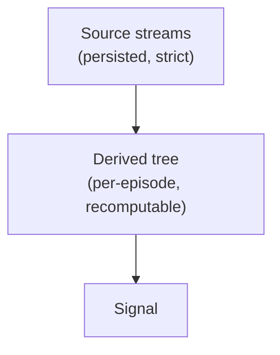

# Architecture



**Source** is persisted strictly and structurally — the observed streams (LOB, Trades, OI, Liqs, MC,
LSR, News): a property of the situation. **Derived** values ("Indies") are computed on top
per-episode and never touch the source store; they can always be recalculated, so recomputing them
can't muddy persistence.

Two sentences hold up everything below, and each sub-crate is one of them made mechanical:

- **A strategy may read only what it had already received.** So the stream's order is *reception*
  order, and reception is a reading only we can make — the venue's execution axis says what
  happened, never when we could have acted on it.
- **Backtest and live are the same graph over the same events — not the same run.** The seam
  between them is only where events come from, and no node may read *whether* a dep produced on a
  given tick, so a node's output is never a measurement of the feed's batching. What a backtest
  does differ in is how often nodes get to look at all: it batches to finish faster, and inside a
  batch the strategy never acts between events that arrived apart. That is the approximation, it is
  deliberate, and [backtests are fundamentally imprecise](#live-never-clocks-a-backtest-is-expected-to)
  because of it.

## Crates

```
trading_data_expr           #![no_std], zero deps — the primitive algebra: one expression, four readings
                            (eval / exact grad / LaTeX / value-annotated trace)
trading_data_dag                     #![no_std], zero deps — domain-free derivation engine
trading_data_derivatives    the fundamental primitives: indicator state machines, and the bar/RSI nodes that are
                            nothing but those machines wired to a series — every strategy names these
trading_data_core           the shared parse boundary both exchange_interactions and persistence see: BatchTrades, the raw
                            columnar lane holders, the Book fold + ShadowBook, and (orphan rules) their dag impls
trading_data_persistence    arrow/parquet — catalog, lanes, feather writer, and `sync`: the central replay/live weaver
trading_data_macros         proc-macro home of `#[node]` and `graph!`: the first leaves a node's `Deps` where a
                            macro can read them, the second walks them into the `step` chain over whichever path the
                            invoking crate reaches the dag under — its own, or the facade's `__dag`
        ▲          ▲          ▲
        └──────────┴──────────┘
             trading_data            facade/prelude; `required_lanes<G>()` maps a graph's dep tree to source lanes
                   ▲
    trading_data_simple (examples/simple)   one day, one root, one RSI chain — the cheap framework testbed
    trading_data_live_example (examples/live)   real Bybit trades+book, live until ctrl-c, watchable as it runs
    trading_data_spl (examples/spl)     a whole strategy (scam_pump_liqs); its bus plumbing becomes `type Deps`
```

What each arrow may and may not be — and why an example is allowed exactly one of them — is stated
in [docs/spec/boundaries.md](spec/boundaries.md).

`trading_data`'s `pub use` lists are the client's whole vocabulary, and are pinned as such: a name is
there because a graph, a `#[node]` body or a call into the storage tier can spell it, and everything
`#[node]`/`graph!` writes on the author's behalf is reached through `__dag` instead. Two invariants
hold it together, both checked in `trading_data/tests/facade_surface.rs` — a cell and its
`__td_node_` shim are exported together, and a type a client must spell to call an exported item is
itself exported — over a snapshot of the list, so a name enters or leaves by review.

`trading_data_core` sits below both persistence and the external `exchange_interactions` bridge, so a live ws
`BatchTrades` extends the lane columns and the parquet writer in one pass — no exchange type leaks
into the store, no store type leaks into the exchange layer.

`trading_data_dag`'s `no_std` IS the enforced boundary: the engine can never grow domain or I/O
knowledge. Persistence knows nothing of derivations. Core depends on the dag for `Flat`/`Glance`/
`Cell` only because orphan rules put a type's impls in the type's crate — nothing flows back.

### Where the detail lives

Two sub-crates carry their own design document, written in their own primitives. This file states
what they are *for* and what the rest of the system may assume of them; it does not restate how
they work.

| document | covers |
|---|---|
| [`trading_data_dag/model.typ`](../trading_data_dag/model.typ) | declaration → derivation → sweep → observation; the five dep spellings and what each retains; the step family; `Horizon`/`CLOCK`; the out plane (`Flat`, `Jac`, `Latent`, …); every enforcement point; a compile-time census of which primitives the examples actually use |
| [`trading_data_persistence/weaver.typ`](../trading_data_persistence/weaver.typ) | the `Arrival` key and the read clock; the lane; the merge step; the five lanes and their shapes; the two feeds; what the storage round-trip proves, and why it is not evidence that a backtest reproduces a live run |

The same pattern is meant to repeat downward: a document reasons in the primitives of its own
level and links out for the tier below.

## Raw columnar lanes

A lane is columns, not rows, and the columns are **raw** end to end: venue `i32` → lane `i32` →
parquet `i32`, and back. Precision belongs to the *holder* (`TradeCols::prec`), not the element, so a
node hoists `prec.price_scale()` once per run and divides inside the loop — one setup per batch
instead of a conversion per element, and no f64 round trip anywhere to lose a bit in. The single
decimal→raw conversion left is at the CSV parse boundary, where the exactness assert belongs.

The one lane that carries precision per *element* is the book's, and it says why the rule is
otherwise: a retained lane is a run of items the engine hands out one at a time, so nothing holder-
shaped survives to scale them by. Precision-on-the-holder is what keeps a run whole elsewhere —
`Feather::extend(cols)` is one append and one rotation check for a whole venue message, where the
row model was N pushes and N flush checks.

Each lane keeps its natural shape — Oi/Mc are genuinely f64 and stay `&[Oi]`/`&[Mc]`. Uniformity
across lanes was the sin of the tagged-union batch this replaced.

## Record the decision, not the evidence

Anything a replay would otherwise have to *re-derive from circumstance* is decided once, at ingest,
and written down as a fact on disk. That is the persistence layer's whole shape, and it is what makes
a recording replayable rather than merely re-readable: arrival order, book reconciliation, lane
precision and file extent are all decisions, not measurements to be repeated.

The load-bearing case is the book. A gap or a resync is a fact about *our connection*, not about the
market — stored raw, every replay would re-derive the reconciliation from whichever venue snapshots
happened to land, a cadence we neither control nor can reproduce. So `ShadowBook` consumes the venue
stream at ingest and emits ours: the persisted delta lane is our own recollection, gapless and
self-consistent, with checkpoints on our cadence and venue snapshots consumed but never stored. The
reconciliation survives per row as `Update` vs `Correction`, so a flow or imbalance node must say
which it means and cannot fabricate signal out of a dropped websocket packet. It used to be the
frame's *identity*, unreachable without destructuring; retaining the lane cost that, and the trade
is recorded in `weaver.typ` §1.8.

The exception proves the rule: a historic row we were not present for has no recorded reception, so
that one key is manufactured — deterministically, seeded on lane and symbol, so two runs of a range
weave identically. Per-case detail, and the enforcement, in
[`weaver.typ`](../trading_data_persistence/weaver.typ) §1.8.

<a id="dep_tree"></a>
## Dependency tree

Derived values form a DAG known at compile time. We express the edges in the type system:
each node names its dependencies as a type, the compiler enforces a valid evaluation order,
and cycles are unrepresentable — at zero runtime cost.

`type Deps` **is** the graph. A `graph!` states its roots and the handful of nodes an app reads —
`outputs` and `observe` — and the node set, its topological order, every buffer's size, and which
nodes may go dark are derived from there by walking `Deps` backwards. A node no output reaches is
never instantiated: unneeded work is not merely unused, it does not exist, and neither does the
source lane that would have fed it. The whole sweep monomorphizes to one straight-line function.

Cells are GAT-shaped and **batch-native**: an out is `&'t [T]` (a run of events) or `&'t Book`, a
first-class dependency rather than a side-channel context argument. `advance` self-borrows, so a
node lends its own emission buffer for the whole tick:

```rust
pub trait Cell { type Out<'t>: Copy; }             // &'t [T] and &'t Book are Outs
pub trait Node: Cell {
    type Deps: DepSet;                             // the edges, as a tuple of Cells
    fn advance<'t>(&'t mut self, deps: DepOuts<'t, Self>) -> Self::Out<'t>;
}
```

Everything an author would otherwise have to state by hand is instead read off that one type. Three
consequences shape how a strategy is written; the mechanisms are `model.typ`'s subject:

- **A dep says which *reading* of its producer it wants** — this tick's batch, a window, the last
  value whenever it came, or a claim to fold the series itself. The axis those spellings partition
  is *who holds the history*: history the engine holds re-warms through a skip, history a node holds
  cannot — so the compiler refuses to gate a node that folds its own reach. *How* the engine holds it
  is the series' own to say: the default keeps every row, and a series whose rows collapse — a book's
  levels keep only the last qty per price — declares a fold instead and pays depth rather than
  volume. That is what makes retention affordable for a lane no buffer could otherwise hold. It
  *bounds* how long a node may sleep, though; it does not close the question, and a sleep past the
  bound is what anchoring below is for.
- **Gating and demand are the same edge read in the two directions.** Gating states what a node
  needs; demand is whether anyone will read what it produces, derived per node from the gates
  dominating every path to an output. Neither is the author's to restate — a hand-written badge on
  six indicators is six restatements of what one edge already said. What a skip costs the author is
  a *type*: an out with no unfired reading cannot be skipped, and says so at compile time.
  Demand is a *formula*, not a set: `⋁ over consumers c of (demand(c) ∧ ⋀ gates(c))`. A set could
  only have meant AND, and two consumers behind different gates would intersect to nothing — which
  reads as "always on", the degenerate answer and exactly the one the interesting cases hit. The one
  thing an author does state is whether a skipped tick is recoverable (`Cell::REWARMS`), because that
  is what decides whether a *latch* may appear in the formula: a gate stepped earlier is read off the
  frame and darkens its producers on the same tick, a latch is read from its standing bit and darkens
  them one tick ahead of the consumer arming.
  A node whose sleep outruns every bound is **anchored** instead: it is replayed forward out of the
  driver's recorded past on the tick it is demanded, so there is no window in which a wired node
  reports absence. Recoverability is then the *feed's* claim rather than the graph's — the dag names
  the past by trait and never by type, and a feed with none to seek (any live one) pins every
  anchored node awake for free. The win is upstream of the node: a retention read only by anchored
  nodes sleeps with them, so an undemanded book folds no delta anywhere, not merely none of its own.
- **A node owns its rate.** How often a node publishes is declared on the node, never in `Deps` — so
  no consumer can change the rate of what it reads, and a node clocked to a timeframe sees completed
  elements only. The counterpart obligation is on the dep side: a read never says whether that dep
  produced *this tick*, which is what keeps a node's output a measurement of the market rather than
  of the feed's batching. Both, with their consequences, in [docs/spec/rates.md](spec/rates.md).

And two rules about what belongs in the graph at all:

- **A node is not a pane.** A node names slot groups of its out for drawing, each with its own
  scale and guides — axes partition by *unit*, and one out can mix them. So drawing never motivates
  a node: a step that computes nothing, and differentiates to nothing, stays out of the topology.
- **Universe/cross-sectional ops are graph composition, not an execution tier**: per-symbol graphs
  are values; a universe-level graph ticks at bar cadence, its roots seeded from theirs. Parallelism
  is across symbols (live) / episodes (backtest) only — one graph per unit, rayon across. Never
  intra-tick.

## One graph, one router, two feeds

The **backtest / live** seam is only where events come from. `persistence::sync` weaves the
required source lanes into one arrival-ordered stream of `Lanes` (a `Feed`) — every lane present,
lanes that did not arrive empty. There is no routing discriminant: batch-ness needs no tag, it
iterates, and an app's whole routing layer is `impl From<Lanes> for Batches`. `Replay`
feeds from the catalog; `Live` feeds from push handles and *tees* every event into the same Feather
lanes a backtest later reads. Node code is identical across the two.

What the tee guarantees is a **storage** claim and only that: everything `Live` recorded comes back
out of `Replay`, in order, folding to the same book. It is not a claim that the two runs agree —
see below.

`Live` is **zero-cost**: an event is folded into a tick before the feed blocks on the next one, so
choosing the engine costs nothing hand-rolling the same loop against the raw socket would not have
cost too. No clock boundary, no timer, no fill level, no waiting on a second lane. This is what
rules out every grid-shaped batching scheme that has to know a window is *closed* before it can
emit it — stated, with its consequences, in [docs/spec/feeds.md](spec/feeds.md). A grouping rule
may exist only if it degenerates to on-arrival under `Live` instead of being switched off there.

### Live never clocks; a backtest is expected to

**`Live` states no rate, and cannot be given one.** It weaves on `ReadClock::ALL` — one cell over
all of time — so whatever is buffered by the time it gets there is folded together. That is the
same aggressive batching a backtest does; what is removed is the *waiting*. Live never holds an
event back hoping another arrives, because an absolute cell of any finite size is a wait, and a
`Live` that waits for a cell to close is a `Live` that trades late. How a live run happens to group
is therefore a function of how busy the consumer was, not of a knob.

**`Replay` states a `ReadClock`**, and that is the whole of what the type is for: it cuts arrival
time into cells and hands the graph everything in one cell as a single step, so a backtest gets
through a day faster than the day took. Cells are absolute — floored from the epoch, not from the
last emission — so which cell an event falls in is a property of the event alone and a replay of a
range groups identically every time. A venue message never splits, and `ReadClock::EVENT` is a
zero-length cell, so "no batching" is the degenerate setting rather than a separate path.

**Inside one cell, events get mixed up, and that is expected.** Two events that arrived a
millisecond apart land in the same 100ms cell and reach the graph together; the strategy never gets
to act between them, and so it can decide differently than it would have on the live wire. Fold
*order* is untouched, and no node may read *whether* a dep produced on a given tick — so a node's
output is never a measurement of the batching. What does change is how often nodes get to look at
all, which for anything reading a running extremum or a threshold crossing over *evaluated* states
is a real difference in what it sees.

**We do not care about those mismatches, and nothing should assert them away.** A backtest is a
model of a live run, and the batching above is exactly where it is lossy; the read clock is the dial
between how fast the backtest finishes and how finely it resolves. Treating a backtest as though it
reproduced a live run — asserting the two agree event for event, tuning until they do — buys a green
check that means nothing and costs confusion later, when the difference that mattered gets read as a
bug in the engine rather than as the approximation it always was. **Backtests are fundamentally
imprecise.** Size the read clock for the question being asked, and read the answer as an estimate.

The two feeds also differ in cost profile. `Live` is streaming and memory-bounded: a long-lived
session accumulates nothing and tees to disk incrementally. `Replay` eager-loads its range, so a
window wider than memory is *chained* — successive `Replay`s over one long-lived graph, which
carries its node state across. Both, and what the weave does and does not promise, in
[`weaver.typ`](../trading_data_persistence/weaver.typ) §1.7 and §1.9.

## Polars boundary

No polars execution tier in the engine, ever. Measured: columnar execution *loses* to the
interleaved sweep — indicators are recurrences/sliding windows (sequential carry, no SIMD
lanes exist). Polars remains (a) offline research/EDA over the parquet, (b) a test oracle in
property tests (dev-dep only).
